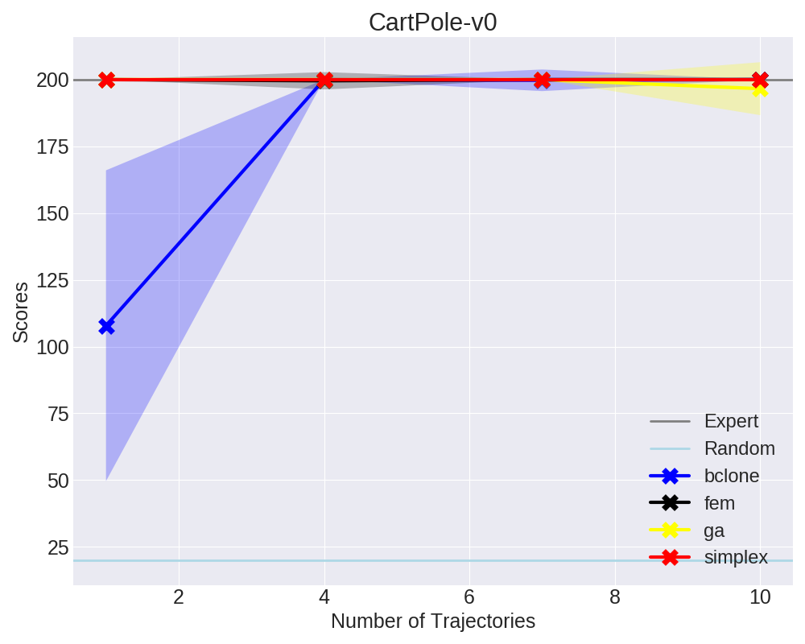
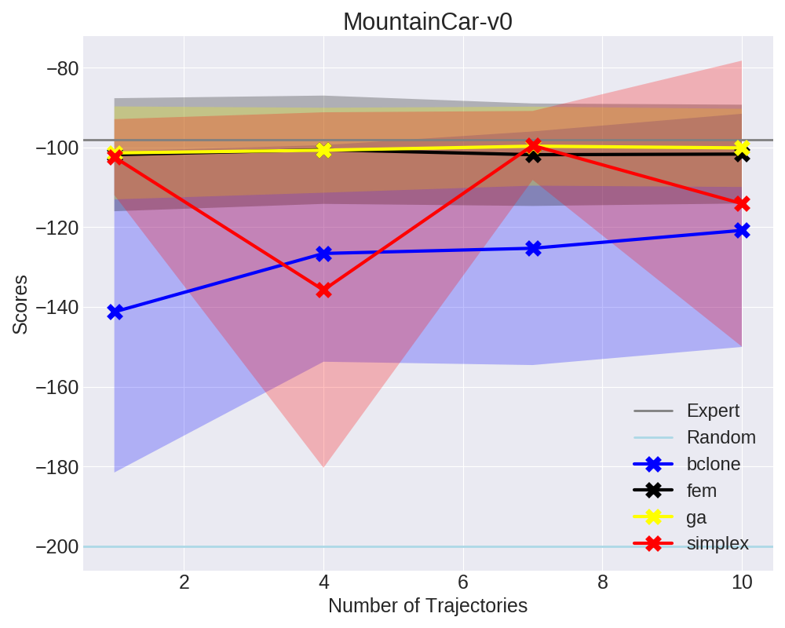

# Fork of Generative Adversarial Imitation Learning

## Timing

(For Step 2, the major bottleneck)

- **Classic**: ~11 hours.
- **ModernStochastic**: ~60 hours. Gaaah.
- **ModernEntreg**: each regularization value takes ~10 hours, so ~30 hours total
  for the three values.
- **Humanoid**: N/A

Yeah, I wish there was a better way to do this sequentially. Probably Scala
would be the best option. Remember that the classic ones and Reacher
("ModernEntreg") used seven random initializations.

## Plots

Overall, these closely match the results in the GAIL paper.

### Classical

Meh

Meh

### Modern

Wow, HalfCheetah is very close to what's reported in the paper! The other two
competing methods are barely above random, if at all. And the strong BC
performance is corroborated by my `rl_algorithms` BC results. Interesting!

Yes, for some reason (and this is true in the GAIL paper) the two competing IL
algorithms are really bad for Ant-v1, **substantially worse** than the expert.
And my `rl_algorithms` code shows that indeed BC is good on Ant-v1.

Once again, this plot as a whole agrees with the GAIL paper.  My `rl_algorithms`
code agrees that BC doesn't do that well on Hopper-v1 until using lots of
samples. 

My `rl_algorithms` code agrees that BC doesn't do that well on Walker2d-v1,
though these results are probably even worse! This figure is similar to what's
in the GAIL paper, and yes GAIL seems to get superior performance compared to
the expert.

### Modern, Entropy Regularization

Wow, this is almost exactly like the figure in the GAIL paper!

